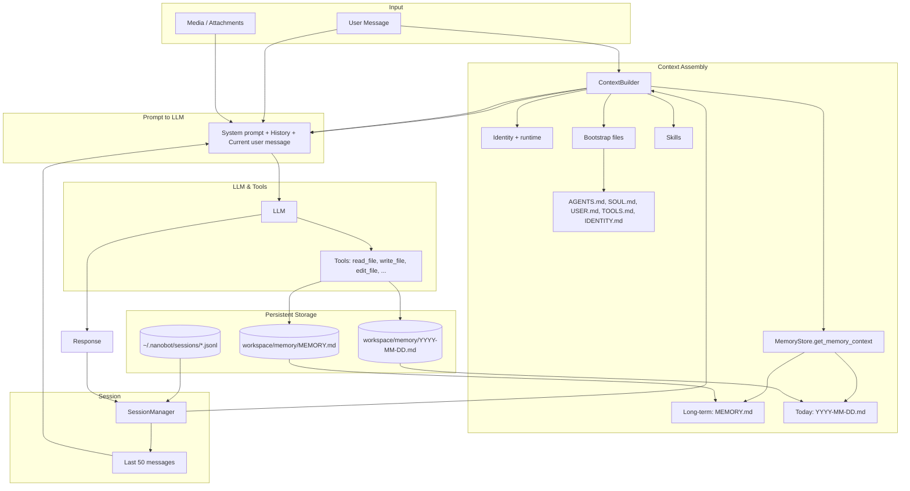

# Nanobot Memory & Context

This document describes how Nanobot maintains context and persistent memory: what gets loaded into each prompt and where it is stored.

## 1. Architectural Overview

Nanobot separates **context** (what is sent to the LLM on each turn) from **persistent storage** (where memory and conversation history live).

| Component | Role |
|-----------|------|
| **ContextBuilder** (`context.py`) | Builds the full prompt: identity, bootstrap files, memory text, skills, and conversation history. “Working” context for the current request. |
| **MemoryStore** (`memory.py`) | File-based persistent memory: long-term (`MEMORY.md`) and daily notes (`YYYY-MM-DD.md`). Read into the system prompt. |
| **SessionManager** (`session/manager.py`) | Per-session conversation history. Stored as JSONL; last N messages are included in each request. |

There is **no SQLite database** and **no vector/embedding store**. Memory is plain Markdown files in the workspace. The agent is instructed to *write* to `memory/MEMORY.md` (via the `write_file` / `edit_file` tools) when it wants to remember something; there is no separate “memory extractor” or “consolidator” pipeline.

## 2. Memory Data Flow (Mermaid)

The following diagram shows how a user message becomes a full prompt and how memory is used. Session history and memory are **read** into context; long-term memory is **written** by the agent via tools when it chooses.



**In words:**

1. **ContextBuilder** builds the system prompt from: identity, bootstrap files, **MemoryStore.get_memory_context()** (long-term + today only), and skills.
2. **SessionManager** supplies the last 50 messages for that session; they are appended after the system prompt, then the current user message.
3. The combined prompt is sent to the **LLM**. If the model calls **write_file** or **edit_file** on `memory/MEMORY.md` or `memory/YYYY-MM-DD.md`, that updates persistent memory for future turns.
4. The final response is appended to the session and saved by **SessionManager**.

## 3. What Counts as “Memory” vs “Context”

| Layer | Content | Storage | Used in prompt |
|-------|---------|--------|----------------|
| **Long-term memory** | Persistent facts the agent (or user) writes to `MEMORY.md` | `workspace/memory/MEMORY.md` | Yes, full file via `get_memory_context()` |
| **Today’s notes** | Same-day notes in a daily file | `workspace/memory/YYYY-MM-DD.md` | Yes, via `get_memory_context()` |
| **Conversation history** | Last 50 user/assistant messages per session | `~/.nanobot/sessions/{key}.jsonl` | Yes, as message history |
| **Bootstrap / identity** | AGENTS.md, SOUL.md, USER.md, TOOLS.md, IDENTITY.md + runtime/workspace info | `workspace/*.md` | Yes, in system prompt |

**Not currently used in the prompt:** `MemoryStore.get_recent_memories(days)` and `append_today()` exist in the API but are not called from `get_memory_context()`, so “last 7 days” of daily files are not automatically included. Only long-term + today are.

## 4. How “Remembering” Works

There is **no automatic fact extraction**. The system prompt tells the agent that when it needs to remember something, it should write to `workspace/memory/MEMORY.md`. So:

1. **Remember:** The agent uses the **write_file** or **edit_file** tool to update `memory/MEMORY.md` (or today’s daily file).
2. **Recall:** On every request, **ContextBuilder** calls `memory.get_memory_context()`, which reads `MEMORY.md` and today’s `YYYY-MM-DD.md` and injects them into the system prompt under a “# Memory” section.

So memory is **agent-written, file-based, and full-text** in the prompt (no embedding or semantic search).

## 5. Persistence & Locations

All state is file-based and survives restarts.

| What | Location |
|------|----------|
| Long-term memory | `{workspace}/memory/MEMORY.md` |
| Daily notes | `{workspace}/memory/YYYY-MM-DD.md` |
| Session history | `~/.nanobot/sessions/{channel}_{chat_id}.jsonl` |

- **Workspace** is the project directory (e.g. `nanobot init` target). Memory lives under that workspace.
- **Sessions** are under `~/.nanobot/sessions/`, keyed by `channel:chat_id` (e.g. `cli_direct.jsonl`).

**Docker:** To keep memory and sessions across container restarts, mount the workspace and the home nanobot dir, e.g.:

```bash
docker run -v /path/to/workspace:/workspace -v ~/.nanobot:/root/.nanobot ...
```

## 6. Summary

- **Context** = system prompt (identity + bootstrap + memory + skills) + session history + current message. Built by **ContextBuilder** using **MemoryStore** and **SessionManager**.
- **Memory** = file-based: `MEMORY.md` (long-term) and `YYYY-MM-DD.md` (today). Injected in full into the system prompt; no SQLite, no vectors.
- **Sessions** = last 50 messages per `channel:chat_id`, stored in `~/.nanobot/sessions/*.jsonl`.
- **Remembering** = agent writes to `memory/MEMORY.md` (or daily file) via tools; no separate extractor or consolidator.
